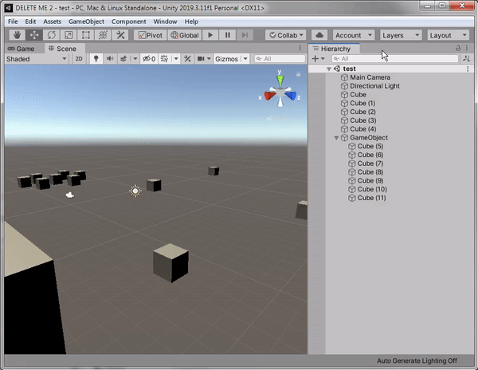

# UnityHierarchyOnOverHelper
Highlight objects in Unity when the mouse overs them in the Hierarchy window

Just drag and drop (hehe) the folder `HierarchyOnOverHelper` anywhere in the Assets folder of your Unity project.

